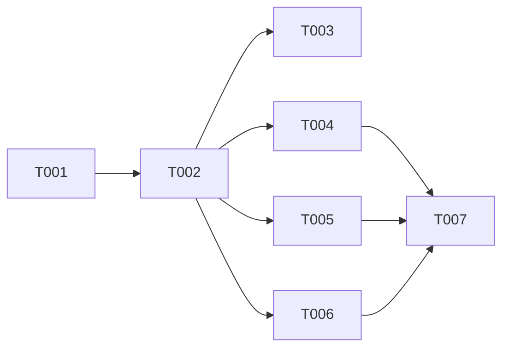

# Plan: Extract Shared Registry Schema Package

> Track: extract-shared-registry-20260408
> Spec: [spec.md](./spec.md)

## Overview

- **Source**: /please:plan
- **Track**: extract-shared-registry-20260408
- **Issue**: #14
- **Created**: 2026-04-08
- **Approach**: Pragmatic

## Purpose

After this change, both the CLI and registry app will import registry types, Zod schemas, and the `expandStrategies()` utility from a single shared package (`@pleaseai/registry-schema`). Developers can verify it works by running `bun run build` at the root and confirming all existing tests pass.

## Context

The CLI (`packages/cli/src/registry.ts`) defines `RegistryStrategy`, `RegistryAlias`, and `RegistryEntry` as TypeScript interfaces. The registry app (`apps/registry/content.config.ts`) defines semantically identical Zod schemas (`strategySchema`, `aliasSchema`) independently. The `expandStrategies()` function exists in both `packages/cli/src/registry-schema.ts` and `apps/registry/server/api/registry/[...slug].get.ts` with an explicit comment noting the intentional duplication due to Nitro's inability to resolve workspace imports.

A dedicated shared package with built output (`dist/`) resolves the Nitro constraint and eliminates all duplication. The CLI already depends on `zod`, so switching from hand-written interfaces to `z.infer<>` types is a net simplification. The registry app's `content.config.ts` uses `z` from `@nuxt/content` (a zod re-export), so it can consume exported Zod schemas from the shared package directly.

## Architecture Decision

A new `packages/registry-schema` package provides Zod schemas as the single source of truth. TypeScript types are derived via `z.infer<>`, eliminating the need to maintain parallel interface definitions. The package builds with `tsc` to `dist/`, the same as the CLI. Because `turbo.json` already has `"dependsOn": ["^build"]`, the shared package builds before its consumers automatically. The `content.config.ts` in the registry app will import the Zod schema objects and spread them into `defineCollection`, while the API handler will import `expandStrategies` directly — no more intentional duplication.

## Architecture Diagram

```
                    packages/registry-schema
                    (@pleaseai/registry-schema)
                   ┌───────────────────────┐
                   │ src/index.ts           │
                   │  • strategySchema (Zod) │
                   │  • aliasSchema (Zod)    │
                   │  • registryEntrySchema  │
                   │  • RegistryStrategy (T) │
                   │  • RegistryAlias (T)    │
                   │  • RegistryEntry (T)    │
                   │  • expandStrategies()   │
                   └───────────┬───────────┘
                           │
              ┌───────────┴───────────┐
              ▼                       ▼
   packages/cli              apps/registry
   • registry.ts              • content.config.ts
     (re-exports types,        (imports schemas)
      removes interfaces)    • server/api/[...slug].get.ts
   • registry-schema.ts         (imports expandStrategies,
     (deleted)                  removes local duplication)
```

## Tasks

- [x] T001 Create `packages/registry-schema` package scaffold (file: packages/registry-schema/package.json)
- [x] T002 Define Zod schemas and inferred types with `expandStrategies()` (file: packages/registry-schema/src/index.ts, depends on T001)
- [x] T003 Add unit tests for shared package (file: packages/registry-schema/test/index.test.ts, depends on T002)
- [x] T004 [P] Migrate CLI to import from `@pleaseai/registry-schema` (file: packages/cli/src/registry.ts, depends on T002)
- [x] T005 [P] Migrate registry `content.config.ts` to import schemas (file: apps/registry/content.config.ts, depends on T002)
- [x] T006 [P] Migrate registry API handler to import from shared package (file: apps/registry/server/api/registry/[...slug].get.ts, depends on T002)
- [x] T007 Verify monorepo build, lint, and tests (depends on T004, T005, T006)

## Dependencies



## Key Files

### Create

- `packages/registry-schema/package.json` — shared package manifest
- `packages/registry-schema/tsconfig.json` — TypeScript config (mirrors CLI)
- `packages/registry-schema/eslint.config.ts` — ESLint config
- `packages/registry-schema/src/index.ts` — Zod schemas, inferred types, `expandStrategies()`
- `packages/registry-schema/test/index.test.ts` — unit tests

### Modify

- `packages/cli/src/registry.ts` — remove interfaces, re-export types from shared package
- `packages/cli/src/registry-schema.ts` — delete (moved to shared package)
- `packages/cli/package.json` — add `@pleaseai/registry-schema` dependency
- `apps/registry/content.config.ts` — import schemas from shared package
- `apps/registry/server/api/registry/[...slug].get.ts` — import `expandStrategies` and types
- `apps/registry/package.json` — add `@pleaseai/registry-schema` dependency

### Reuse

- `turbo.json` — no changes needed (`^build` already handles dependency ordering)
- `package.json` (root) — no changes needed (`packages/*` glob already includes new package)

## Verification

### Automated Tests

- [ ] `expandStrategies()` unit tests pass in shared package
- [ ] Existing CLI tests pass unchanged (`bun test --cwd packages/cli`)

### Observable Outcomes

- Running `bun run build` at root succeeds with no errors
- Running `bun run lint` at root succeeds with no errors
- `grep -r "expandStrategies" apps/registry/server/` shows import from `@pleaseai/registry-schema`, not local definition
- `grep -r "interface RegistryStrategy" packages/cli/src/` returns no matches

### Acceptance Criteria Check

- [ ] SC-1: `packages/registry-schema` exists with schemas, types, and `expandStrategies()`
- [ ] SC-2: CLI imports types from `@pleaseai/registry-schema`
- [ ] SC-3: Registry imports schemas/functions from `@pleaseai/registry-schema`
- [ ] SC-4: All CLI tests pass
- [ ] SC-5: Registry builds successfully
- [ ] SC-6: `bun run build` succeeds
- [ ] SC-7: `bun run lint` passes

## Decision Log

- Decision: Use Zod schemas as single source of truth, derive TypeScript types via `z.infer<>`
  Rationale: Eliminates parallel maintenance of interfaces and schemas; CLI already depends on zod
  Date/Author: 2026-04-08 / Claude
- Decision: Move zod to peerDependencies instead of dependencies
  Rationale: Avoids dual Zod instance between shared package and @nuxt/content (review finding)
  Date/Author: 2026-04-08 / Claude

## Outcomes & Retrospective

### What Was Shipped
- New `packages/registry-schema` package with Zod schemas, inferred types, and `expandStrategies()`
- CLI and registry app migrated to import from shared package
- All duplicated type definitions and functions eliminated

### What Went Well
- Turbo's `^build` dependency ordering worked out of the box — no config changes needed
- Workspace `packages/*` glob automatically included the new package
- All 146 existing CLI tests passed without modification after migration

### What Could Improve
- The Nitro "can't resolve workspace imports" constraint turned out to be solvable with a built package — could have been resolved earlier

### Tech Debt Created
- Pre-existing lint errors in `apps/registry/` Vue files remain (not introduced by this PR)
